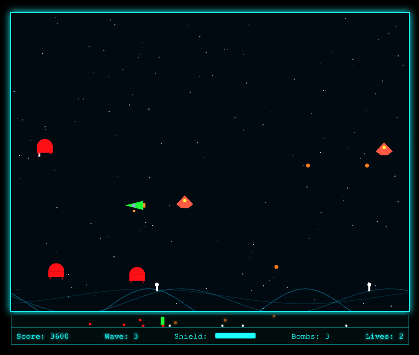

# Defender Ascendant



Defender Ascendant is a modern browser-based arcade game inspired by classic side-scrolling shooters. Take control of your ship to rescue humanoids, battle waves of enemies, and survive as long as you can!

## Features
- Fast-paced arcade gameplay with smooth controls
- Rescue humanoids while battling Landers and Mutants
- Smart bombs, shields, and hyperspace mechanics
- Dynamic enemy AI and wave progression
- Sound effects powered by [Tone.js](https://tonejs.github.io/)
- Responsive UI and radar minimap

## Controls
- **Move:** Arrow Keys or WASD
- **Shoot:** Space or Left Ctrl
- **Activate Shield:** Shift
- **Smart Bomb:** B
- **Hyperspace:** H
- **Start/Restart:** Enter or on-screen button

## How to Play
- Defend the planet by shooting down enemy Landers and Mutants.
- Rescue humanoids by intercepting them before they are abducted or by catching them as they fall.
- Use smart bombs and shields strategically to survive challenging waves.
- Progress through increasingly difficult waves and aim for a high score!

## Getting Started
1. **Clone the repository:**
   ```sh
   git clone https://github.com/mckinleymedia/defender-ascendant.git
   ```
2. **Open `index.html` in your browser** (no build step required).

Or play the latest version online: [defender-ascendant.vercel.app](https://defender-ascendant.vercel.app/)

## Development
- All game logic and UI are contained in `index.html`.
- Audio is generated in-browser using Tone.js (loaded via CDN).
- No dependencies or build tools required for local play.

## License
MIT

---
Created by Will McKinley
